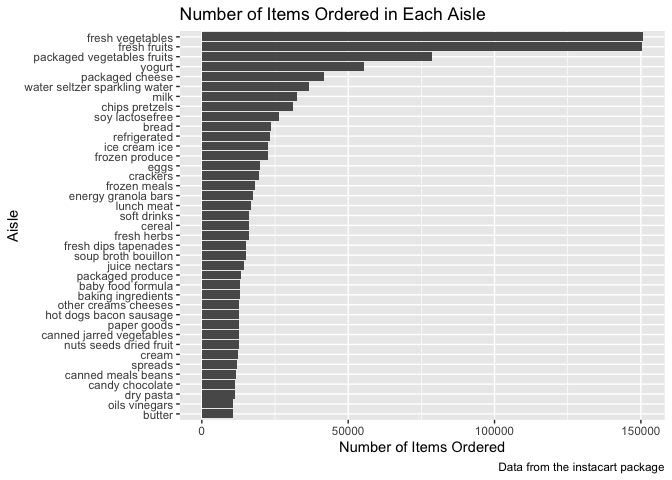
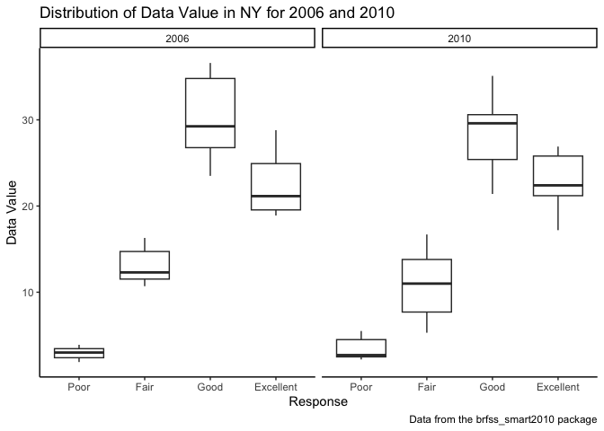
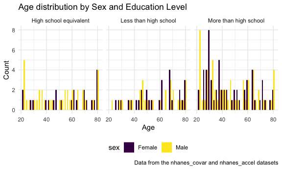

p8105_hw3_xz3173
================
Xue Zhang
2023-10-05

# Problem 1

Load the datasets.

``` r
library(p8105.datasets)
data("instacart")
```

The goal is to do some exploration of this dataset. To that end, write a
short description of the dataset, noting the size and structure of the
data, describing some key variables, and giving illustrative examples of
observations. Then, do or answer the following (commenting on the
results of each):

``` r
head(instacart)
```

    ## # A tibble: 6 × 15
    ##   order_id product_id add_to_cart_order reordered user_id eval_set order_number
    ##      <int>      <int>             <int>     <int>   <int> <chr>           <int>
    ## 1        1      49302                 1         1  112108 train               4
    ## 2        1      11109                 2         1  112108 train               4
    ## 3        1      10246                 3         0  112108 train               4
    ## 4        1      49683                 4         0  112108 train               4
    ## 5        1      43633                 5         1  112108 train               4
    ## 6        1      13176                 6         0  112108 train               4
    ## # ℹ 8 more variables: order_dow <int>, order_hour_of_day <int>,
    ## #   days_since_prior_order <int>, product_name <chr>, aisle_id <int>,
    ## #   department_id <int>, aisle <chr>, department <chr>

- How many aisles are there, and which aisles are the most items ordered
  from?

``` r
# How many number of aisles are there?
num_aisles = length(unique(pull(instacart, aisle)))
num_aisles
```

    ## [1] 134

``` r
# Which aisles are the most items ordered from?
aisle_orders = instacart |>
  group_by(aisle) |>
  summarise(order_count = n()) |>
  arrange(-order_count)

head(aisle_orders)
```

    ## # A tibble: 6 × 2
    ##   aisle                         order_count
    ##   <chr>                               <int>
    ## 1 fresh vegetables                   150609
    ## 2 fresh fruits                       150473
    ## 3 packaged vegetables fruits          78493
    ## 4 yogurt                              55240
    ## 5 packaged cheese                     41699
    ## 6 water seltzer sparkling water       36617

`Fresh vegetables` are the most items ordered from.

- Make a plot that shows the number of items ordered in each aisle,
  limiting this to aisles with more than 10000 items ordered. Arrange
  aisles sensibly, and organize your plot so others can read it.

``` r
# filtering aisles with more than 10000 items ordered
instacart |>
  group_by(aisle) |>
  summarise(order_count = n()) |>
  filter(order_count > 10000) |>
  arrange(order_count) |>

# plotting
  ggplot(aes(x = reorder(aisle, order_count), y = order_count)) +
  geom_bar(stat = "identity") +
  coord_flip() + # to make it horizontal for better readability
  labs(title = "Number of Items Ordered in Each Aisle",
       x = "Aisle",
       y = "Number of Items Ordered",
       caption = "Data from the instacart package") +
  theme(legend.position = "bottom")
```

<!-- -->

- Make a table showing the three most popular items in each of the
  aisles “baking ingredients”, “dog food care”, and “packaged vegetables
  fruits”. Include the number of times each item is ordered in your
  table.

``` r
# defining aisles of interest
aisles_of_interest = c("baking ingredients", "dog food care", "packaged vegetables fruits")

# create the table
popular_items = instacart |>
  filter(aisle %in% aisles_of_interest) |>
  group_by(aisle, product_name) |>
  summarise(order_count = n()) |>
  arrange(aisle, desc(order_count)) |>
  
  # keep the three most popular items in each of the aisles
  group_by(aisle) |>
  filter(min_rank(desc(order_count)) <= 3)
```

    ## `summarise()` has grouped output by 'aisle'. You can override using the
    ## `.groups` argument.

``` r
popular_items
```

    ## # A tibble: 9 × 3
    ## # Groups:   aisle [3]
    ##   aisle                      product_name                            order_count
    ##   <chr>                      <chr>                                         <int>
    ## 1 baking ingredients         Light Brown Sugar                               499
    ## 2 baking ingredients         Pure Baking Soda                                387
    ## 3 baking ingredients         Cane Sugar                                      336
    ## 4 dog food care              Snack Sticks Chicken & Rice Recipe Dog…          30
    ## 5 dog food care              Organix Chicken & Brown Rice Recipe              28
    ## 6 dog food care              Small Dog Biscuits                               26
    ## 7 packaged vegetables fruits Organic Baby Spinach                           9784
    ## 8 packaged vegetables fruits Organic Raspberries                            5546
    ## 9 packaged vegetables fruits Organic Blueberries                            4966

- Make a table showing the mean hour of the day at which Pink Lady
  Apples and Coffee Ice Cream are ordered on each day of the week;
  format this table for human readers (i.e. produce a 2 x 7 table).

``` r
# filter the data for the two products and calculate the mean order hour
product_data = instacart |>
  filter(product_name %in% c("Pink Lady Apples", "Coffee Ice Cream")) |>
  group_by(product_name, order_dow) |>
  summarise(mean_hour = mean(order_hour_of_day, na.rm = TRUE)) |>
  mutate(day_name = factor(order_dow,
                           levels = 0:6,
                           labels = c("Sunday", "Monday", "Tuesday", "Wednesday", "Thursday", "Friday", "Saturday"))) |>
  select(-order_dow)
```

    ## `summarise()` has grouped output by 'product_name'. You can override using the
    ## `.groups` argument.

``` r
# reshape the data for a 2 by 7 table format
table_data = product_data |>
  group_by(product_name) |>
  pivot_wider(
    names_from = day_name,
    values_from = mean_hour)

table_data
```

    ## # A tibble: 2 × 8
    ## # Groups:   product_name [2]
    ##   product_name     Sunday Monday Tuesday Wednesday Thursday Friday Saturday
    ##   <chr>             <dbl>  <dbl>   <dbl>     <dbl>    <dbl>  <dbl>    <dbl>
    ## 1 Coffee Ice Cream   13.8   14.3    15.4      15.3     15.2   12.3     13.8
    ## 2 Pink Lady Apples   13.4   11.4    11.7      14.2     11.6   12.8     11.9

The `instacart` dataset has 1384617 observations and 15 variables. There
are 134 aisles are there, and `fresh vegetables` aisles are the most
items ordered from.

# Problem 2

Import data

``` r
data("brfss_smart2010") 
```

First, do some data cleaning:

``` r
brfss_smart2010 = brfss_smart2010 |> 
  
  # format the data to use appropriate variable names
  janitor::clean_names() |>
  
  # focus on the “Overall Health” topic
  filter(topic == "Overall Health") |>
  
  # include only responses from “Excellent” to “Poor”
  filter(response %in% c("Excellent", "Poor")) |>
  
  # organize responses as a factor taking levels ordered from “Poor” to “Excellent”
  mutate(response = factor(response, 
                           levels = c("Poor", "Excellent"),
                           ordered = TRUE))
```

- In 2002, which states were observed at 7 or more locations? What about
  in 2010?

``` r
brfss_smart2010 |>
  group_by(year, locationabbr) |>
  summarise(n_locations = n_distinct(locationdesc)) |>
  filter((year == 2002 | year == 2010) & n_locations >= 7)
```

    ## `summarise()` has grouped output by 'year'. You can override using the
    ## `.groups` argument.

    ## # A tibble: 20 × 3
    ## # Groups:   year [2]
    ##     year locationabbr n_locations
    ##    <int> <chr>              <int>
    ##  1  2002 CT                     7
    ##  2  2002 FL                     7
    ##  3  2002 MA                     8
    ##  4  2002 NC                     7
    ##  5  2002 NJ                     8
    ##  6  2002 PA                    10
    ##  7  2010 CA                    12
    ##  8  2010 CO                     7
    ##  9  2010 FL                    41
    ## 10  2010 MA                     9
    ## 11  2010 MD                    12
    ## 12  2010 NC                    12
    ## 13  2010 NE                    10
    ## 14  2010 NJ                    19
    ## 15  2010 NY                     9
    ## 16  2010 OH                     8
    ## 17  2010 PA                     7
    ## 18  2010 SC                     7
    ## 19  2010 TX                    16
    ## 20  2010 WA                    10

- Construct a dataset that is limited to Excellent responses, and
  contains, year, state, and a variable that averages the data_value
  across locations within a state. Make a “spaghetti” plot of this
  average value over time within a state (that is, make a plot showing a
  line for each state across years – the geom_line geometry and group
  aesthetic will help).

``` r
excellent_df = brfss_smart2010 |>
  filter(response == "Excellent") |>
  group_by(year, locationabbr) |>
  summarise(average_value = mean(data_value, na.rm = TRUE))
```

    ## `summarise()` has grouped output by 'year'. You can override using the
    ## `.groups` argument.

``` r
ggplot(excellent_df, aes(x = year, y = average_value, group = locationabbr, color = locationabbr)) +
  geom_line() +
  labs(title = "Average Value Over Time for 'Excellent' Response", 
       x = "Year", 
       y = "Average Value",
       caption = "Data from the brfss_smart2010 package") +
  theme_classic() +
  theme(legend.position = "bottom")
```

<!-- -->

- Make a two-panel plot showing, for the years 2006, and 2010,
  distribution of data_value for responses (“Poor” to “Excellent”) among
  locations in NY State.

``` r
ny_df = brfss_smart2010 |>
  filter(locationabbr == "NY" & (year == 2006 | year == 2010))

ggplot(ny_df, aes(x = response, y = data_value)) +
  geom_boxplot() +
  facet_grid(. ~ year) +
  labs(title = "Distribution of Data Value in NY for 2006 and 2010", 
       x = "Response", 
       y = "Data Value",
       caption = "Data from the brfss_smart2010 package") +
  theme_classic() +
  theme(legend.position = "bottom")
```

<!-- -->

# Problem 3

Import datasets.

``` r
nhanes_covar =
  # import dataset
  read_csv("data/nhanes_covar.csv", skip = 4) |>
  
  # clean names
  janitor::clean_names() |>
  
  # ensure variables are appropriate encoded
  
  mutate(
   sex = 
      case_match(
        sex,
        1 ~ "Male",
        2 ~ "Female"),
    
    education =
      case_match(
        education,
        1 ~ "Less than high school",
        2 ~ "High school equivalent",
        3 ~ "More than high school")) |>
  
  # exclude participants less than 21 years of age, and those with missing demographic data; 
  filter(age >= 21, 
         !is.na(bmi))
```

    ## Rows: 250 Columns: 5
    ## ── Column specification ────────────────────────────────────────────────────────
    ## Delimiter: ","
    ## dbl (5): SEQN, sex, age, BMI, education
    ## 
    ## ℹ Use `spec()` to retrieve the full column specification for this data.
    ## ℹ Specify the column types or set `show_col_types = FALSE` to quiet this message.

``` r
nhanes_accel =
  read_csv("data/nhanes_accel.csv") |>
  janitor::clean_names()
```

    ## Rows: 250 Columns: 1441
    ## ── Column specification ────────────────────────────────────────────────────────
    ## Delimiter: ","
    ## dbl (1441): SEQN, min1, min2, min3, min4, min5, min6, min7, min8, min9, min1...
    ## 
    ## ℹ Use `spec()` to retrieve the full column specification for this data.
    ## ℹ Specify the column types or set `show_col_types = FALSE` to quiet this message.

Merge datasets.

``` r
merged_df = nhanes_covar |>
  inner_join(nhanes_accel, by = "seqn")
```

Produce a reader-friendly table for the number of men and women in each
education category,

``` r
education_table = merged_df |>
  group_by(sex, education) |>
  summarise(count = n())
```

    ## `summarise()` has grouped output by 'sex'. You can override using the `.groups`
    ## argument.

``` r
print(education_table)
```

    ## # A tibble: 6 × 3
    ## # Groups:   sex [2]
    ##   sex    education              count
    ##   <chr>  <chr>                  <int>
    ## 1 Female High school equivalent    23
    ## 2 Female Less than high school     28
    ## 3 Female More than high school     59
    ## 4 Male   High school equivalent    35
    ## 5 Male   Less than high school     27
    ## 6 Male   More than high school     56

Create a visualization of the age distributions for men and women in
each education category.

``` r
ggplot(merged_df, aes(x = age, fill = sex)) +
  geom_histogram(position = "dodge", binwidth = 2) +
  facet_grid(. ~ education) +
  labs(title = "Age distribution by Sex and Education Level",
       x = "Age",
       y = "Count",
       caption = "Data from the nhanes_covar and nhanes_accel datasets")
```

<!-- -->

Comment on these items.

Traditional analyses of accelerometer data focus on the total activity
over the day.

Using your tidied dataset, aggregate across minutes to create a total
activity variable for each participant. Plot these total activities
(y-axis) against age (x-axis); your plot should compare men to women and
have separate panels for each education level. Include a trend line or a
smooth to illustrate differences.

``` r
activity_df = merged_df |>
  group_by(seqn, sex, age, education) |>
  summarise(total_activity = sum(min1:min1440, na.rm = TRUE))
```

    ## `summarise()` has grouped output by 'seqn', 'sex', 'age'. You can override
    ## using the `.groups` argument.

``` r
ggplot(activity_df, aes(x = age, y = total_activity, color = sex)) +
  geom_point() +
  geom_smooth(se = FALSE) +
  facet_wrap(. ~ education) +
  labs(title = "Total Activity vs. Age by Education Level",
       x = "Age",
       y = "Total Activity",
       caption = "Data from the nhanes_covar and nhanes_accel datasets") 
```

    ## `geom_smooth()` using method = 'loess' and formula = 'y ~ x'

<!-- -->

Comment on your plot.

Accelerometer data allows the inspection activity over the course of the
day. Make a three-panel plot that shows the 24-hour activity time
courses for each education level and use color to indicate sex.

``` r
inspection_activity = merged_df |>
  pivot_longer(
    cols = starts_with("min"),
    names_to = "Minute",
    names_prefix = "min",
    values_to = "Activity") |>
  mutate(Minute = as.numeric(Minute))

ggplot(inspection_activity, aes(x = Minute, y = Activity, color = sex)) +
  geom_line() +
  facet_grid(. ~ education) +
  labs(title = "24-hour Activity Time Course by Education Level",
       x = "Time of Day",
       y = "Activity",
       caption = "Data from the nhanes_covar and nhanes_accel datasets") +
  theme_classic() +
  theme(legend.position = "bottom")
```

<!-- -->

Describe in words any patterns or conclusions you can make based on this
graph; including smooth trends may help identify differences.
